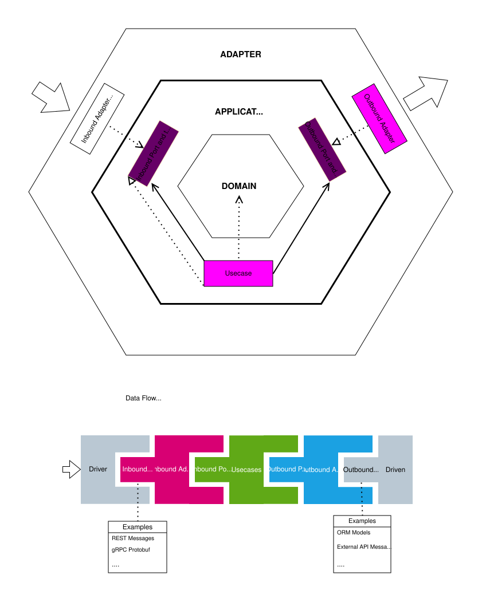

# Ports and Adapters in Golang

These are explenations and specifications for ports and adapters pattern in golang projects.

This structure ensures that the core business logic is decoupled from external infrastructure, making the system more maintainable, testable, and adaptable to technological changes.

## Folders Structure
- **[cmd/](cmd.md)**: Application entry points (composition roots).
- **[configs/](configs.md)**: Configuration templates and environment settings.
- **[scripts/](configs.md)**: Utility and deployment scripts.
- **[internal/](internal.md)**: Main application code, including core logic and adapters.
    - **[core/](internal_core.md)**: The heart of the application, containing domain logic and application use cases.
        - **[domain/](domain.md)**: Pure business entities, value objects, and domain services.
        - **[application/](internal_core_application.md)**: Orchestration logic and system use cases.
            - {app_name} (If there are more than one application)
                - **[ports/](port.md)**: Interfaces defining contracts for inbound and outbound communication.
                    - **[inbound/](inbound_port.md)**: Interfaces defining what the system can do.
                    - **[outbound/](outbound_port.md)**: Interfaces defining what the system needs from external systems.
                - **[usecases/](usecase.md)**: Implementations of the inbound ports.
    - **[adapters/](adapters.md)**: Interaction with the external world.
        - {app_name} (If there are more than one application)
            - **[inbound/](inbound_adapter.md)**: Driving adapters (e.g., HTTP, gRPC, CLI, AMQP, ...).
            - **[outbound/](outbound_adapter.md)**: Driven adapters (e.g., SQL, MongoDB, Redis, External APIs, AMQP, ...).

## Development Flow
1.  **Domain Development**: We can use different approaches to develop the domain layer:
    - **DDD (Domain-Driven)**: Focus on business entities, value objects, and domain services.
    - **RDD (Rich Domain)**: Approach to object-oriented design where your domain objects (the core business entities) contain both **data and behavior**.
    - ...
2.  **Application Development**:
    -   Define **Inbound Ports** (system capabilities).
    -   Define **Outbound Ports** (external dependencies).
    -   Implement **Use Cases** (inbound port implementations).
3.  **Infrastructure Development**:
    -   Implement **Outbound Adapters** (implementing outbound ports).
    -   Implement **Inbound Adapters** (calling use cases via inbound ports).

## Scale

If the project had more than one application each application has a dedicated directory under 
- /cmd/{app-name}
    - main.go
    - ...
- /internal/application/{app-name}
- /internal/adapter/{app-name}